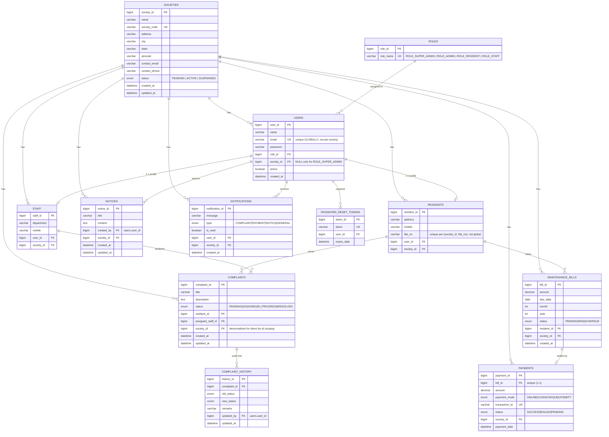

# ER Diagram — Multi-Tenant Smart Society SaaS

`societies` is the tenant root. Every other business table carries a
`society_id` foreign key (denormalized directly onto the table, not just
reachable via a join) so every query — and every unique constraint — can be
scoped with a single indexed column.

## Key multi-tenancy design decisions

| Decision | Why |
|---|---|
| `email` is unique **globally**, not per-society | Login only has an email/password, no society selector. A globally unique email lets `findByEmail` resolve the account (and its society) unambiguously. |
| `flat_no` is unique **per (society_id, flat_no)** | Two different societies legitimately both have a "Flat A-101". |
| `society_id` is denormalized onto every business table, not just derived through a join (e.g. `Complaint.society_id` in addition to `Complaint.resident.society_id`) | Every table with its own `/api/.../{id}` endpoint can be scoped with a single indexed equality filter, and stays correct even if a future query forgets to join through the parent. |
| `ComplaintHistory` and `PasswordResetToken` do **not** carry their own `society_id` | Neither has a direct-by-id REST endpoint; they're only ever reached through an already-scoped parent (`Complaint`, `User`), so the parent's scoping is sufficient. |
| `Society.status` gates login via `CustomUserDetails.isEnabled()`, re-checked from the DB on every request | A suspension takes effect immediately — not after the currently-issued JWTs expire. |
